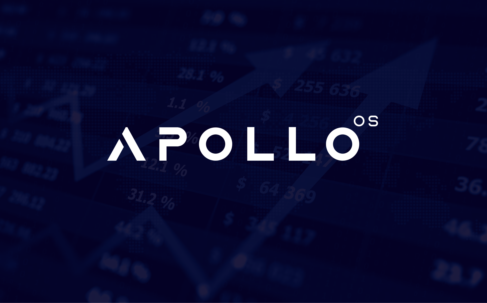

# apollo
Free Open Source software to analyse and filter through S&amp;P 500 companies

[![MIT License][license-shield]][license-url]

<!-- PROJECT LOGO -->
 

  

  <h3 align="center">Apollo Open Source 🚀</h3>
  <h4 align="center">Documentation can be found at: https://apollo-os.com/docs </h4>

<!-- TABLE OF CONTENTS -->

  
<h2 style="display: inline-block">Table of Contents</h2>

  <ol>
    <li> <a href="#about-the-project">About The Project</a> </li>
    <li><a href="#installation">Installation</a></li>
    <li><a href="#contributing">Contributing</a></li>
    <li><a href="#license">License</a></li>
    <li><a href="#disclaimer">Disclaimer</a></li>
    <li><a href="#contacts">Contacts</a></li>
  </ol>

## About The Project

**Why it started:**

During my senior year, I was presented with the opportunity to have the experience of managing a resourse fund for academic purposes. I was shocked to find out that there was not a free tool that could help me filter publicly traded companies through a wide range of ratios, indexes and fundamental/quantitative data. Therefore, I created Apollo, with the hope of providing students, investors and finance enthusiasts the ability to have a powerful software to help them throough their financial research.

**Learn more about Apollo**

Apollo OS provides a modern Python-based  environment for investment and financial markets research, which allows
all types of traders/investors to leverage state-of-the-art Data Science technologies.

As a modern Python-based environment, Apollo OS opens access to numerous Python data libraries.

## Installation

The project currently is at a very-early development phase. Installation guides, tutorials and videos will come in the future, along with progression.

## Contributing

There are 3 main ways of contributing to this project. (Hopefully you have starred the project by now)

**Become a Contributor**

1. Fork the Project
2. Create your Feature Branch (`git checkout -b feature/GreatFeature`)
3. Install the pre-commit hooks by running: `pre-commit install`
4. Commit your Changes (`git commit -m 'Add some GreatFeature'`)
5. Push to your Branch (`git push origin feature/GreatFeature`)
6. Open a Pull Request

You can read more details about adding a feature in our [CONTRIBUTING GUIDELINES](/CONTRIBUTING.md).

**Raise an issue or Request a feature**

- Raise an issue by opening a [bug ticket](https://github.com/Apollo-OS/apollo-os/issues).
- Request a new  feature through a [feature request ticket](https://github.com/Apollo-OS/apollo-os/issues).

**Join us**

Follow our Linkedin [our Linkedin](https://www.linkedin.com/company/apollo-os) and provide us any feedback on Apollo OS.

## License

Distributed under the MIT License. See
[LICENSE](https://github.com/Apollo-OS/apollo-os/blob/main/LICENSE) for more information.

## Disclaimer

"Apollo OS was created for educational purposes. It is not a hedge fund, nor a financial services provider. We have no clients and we DO NOT provide financial advise for anyone!

Trading in financial instruments involves high risks including the risk of losing some, or all, of your investment
amount, and may not be suitable for all investors. Before deciding to trade in a financial instrument you should be fully
informed of the risks and costs associated with trading the financial markets, carefully consider your investment
objectives, level of experience, and risk appetite, and seek professional advice where needed. The data contained in Apollo OS
is not necessarily accurate. Apollo OS and any provider of the data contained in this websit / software will not accept liability for
any loss or damage as a result of your trading, or your reliance on the information displayed.

APOLLO DOES NOT GUARANTEE THE ACCURACY AND/OR THE COMPLETENESS OF ANY DATA RELATED THERETO AND SHALL HAVE NO LIABILITY FOR ANY ERRORS, OMISSIONS OR INTERRUPTIONS THEREIN. APOLLO DOES NOT MAKE ANY WARRANTY, EXPRESS OR IMPLIED, AS TO RESULTS TO BE OBTAINED BY LICENSEE, OWNERS OF THE PRODUCT OR ANY OTHER PERSON OR ENTITY FROM THE USE OF ANY DATA RELATED THERETO. APOLLO DOES NOT MAKE ANY EXPRESS OR IMPLIED WARRANTIES AND EXPRESSLY DISCLAIMS ALL WARRANTIES OF MERCHANTABILITY OR FITNESS FOR A PARTICULAR PURPOSE OR USE WITH RESPECT TO ANY DATA RELATED THERETO. WITHOUT LIMITING ANY OF THE FOREGOING, TO THE MAXIMUM EXTENT ALLOWED BY LAW, APOLLO and ITS CONTRIBUTORS SHALL HAVE NO LIABILITY OR RESPONSIBILITY WHATSOEVER FOR ANY INJURY OR DAMAGES—WHETHER DIRECT, INDIRECT, CONSEQUENTIAL, INCIDENTAL, PUNITIVE OR OTHERWISE—ARISING IN CONNECTION WITH THE PRODUCT OR INDICES OR ANY DATA OR VALUES RELATING THERETO—WHETHER ARISING FROM THEIR NEGLIGENCE OR OTHERWISE, EVEN IF NOTIFIED OF THE POSSIBILITY THEREOF.

## Contacts

If you have any questions, ideas or interest regarding Apollo OS, please feel free to email me at dim.papakyriakopoulos@gmail.com

